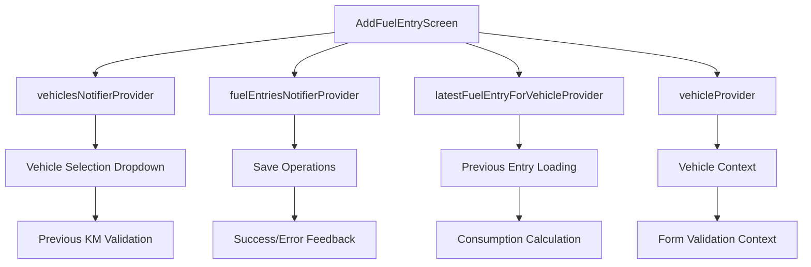

# Fuel Entry Form Implementation Guide

## Technical Implementation Details

This guide provides detailed technical information about the fuel entry form implementation, covering architecture, components, validation, and integration patterns.

## Architecture Overview

### Component Hierarchy
```
AddFuelEntryScreen (ConsumerStatefulWidget)
├── NavAppBar (title: "Add Fuel Entry", actions: [Save])
├── Form (GlobalKey<FormState>)
│   ├── SingleChildScrollView
│   │   ├── _buildVehicleSelection()
│   │   │   ├── DropdownButtonFormField<int> (vehicles)
│   │   │   └── Previous KM info display
│   │   ├── _buildDateSection()
│   │   │   └── InkWell → DatePicker
│   │   ├── _buildKilometersSection()
│   │   │   └── TextFormField (numeric)
│   │   ├── _buildFuelAmountSection()
│   │   │   └── TextFormField (numeric)
│   │   ├── _buildPriceSection()
│   │   │   └── TextFormField (currency)
│   │   ├── _buildPricePerLiterSection()
│   │   │   ├── Switch (auto-calculate toggle)
│   │   │   └── TextFormField (currency)
│   │   └── _buildCountrySection()
│   │       └── CountryDropdown (custom widget)
│   └── _buildSaveButton()
└── FloatingActionButton (alternative save)
```

### State Management Flow


## Core Components Implementation

### 1. AddFuelEntryScreen

#### State Variables
```dart
class _AddFuelEntryScreenState extends ConsumerState<AddFuelEntryScreen> {
  // Form management
  final _formKey = GlobalKey<FormState>();
  
  // Form controllers
  final _fuelAmountController = TextEditingController();
  final _priceController = TextEditingController();
  final _pricePerLiterController = TextEditingController();
  final _kilometersController = TextEditingController();
  
  // Form state
  DateTime _selectedDate = DateTime.now();
  int? _selectedVehicleId;
  String? _selectedCountry;
  bool _isLoading = false;
  double? _previousKm;
  bool _autoCalculatePricePerLiter = true;
}
```

#### Lifecycle Management
```dart
@override
void initState() {
  super.initState();
  // Real-time calculation listeners
  _fuelAmountController.addListener(_onFormChanged);
  _priceController.addListener(_onFormChanged);
  _pricePerLiterController.addListener(_onPricePerLiterChanged);
}

@override
void dispose() {
  // Proper cleanup
  _fuelAmountController.dispose();
  _priceController.dispose();
  _pricePerLiterController.dispose();
  _kilometersController.dispose();
  super.dispose();
}
```

### 2. Vehicle Selection Implementation

#### Dynamic Vehicle Loading
```dart
Widget _buildVehicleSelection() {
  final vehiclesAsync = ref.watch(vehiclesNotifierProvider);
  
  return vehiclesAsync.when(
    data: (vehicleState) {
      if (vehicleState.vehicles.isEmpty) {
        return _buildEmptyVehicleState();
      }
      
      return DropdownButtonFormField<int>(
        value: _selectedVehicleId,
        items: vehicleState.vehicles.map((vehicle) {
          return DropdownMenuItem<int>(
            value: vehicle.id,
            child: Text(vehicle.name),
          );
        }).toList(),
        onChanged: (value) async {
          setState(() => _selectedVehicleId = value);
          if (value != null) {
            await _loadPreviousKmForVehicle(value);
          }
        },
        validator: (value) => value == null ? 'Please select a vehicle' : null,
      );
    },
    loading: () => _buildLoadingDropdown(),
    error: (error, stack) => _buildErrorState(error),
  );
}
```

#### Previous Entry Context Loading
```dart
Future<void> _loadPreviousKmForVehicle(int vehicleId) async {
  try {
    final latestEntry = await ref.read(
      latestFuelEntryForVehicleProvider(vehicleId).future
    );
    
    if (latestEntry != null) {
      setState(() => _previousKm = latestEntry.currentKm);
    } else {
      // Fallback to vehicle initial km
      final vehicle = await ref.read(vehicleProvider(vehicleId).future);
      if (vehicle != null) {
        setState(() => _previousKm = vehicle.initialKm);
      }
    }
  } catch (e) {
    setState(() => _previousKm = null);
  }
}
```

### 3. Date Selection Implementation

#### Future Date Prevention
```dart
Widget _buildDateSection() {
  final now = DateTime.now();
  final isDateInFuture = _selectedDate.isAfter(now);
  
  return Column(
    crossAxisAlignment: CrossAxisAlignment.start,
    children: [
      Text('Date *', style: Theme.of(context).textTheme.titleMedium),
      const SizedBox(height: 8),
      InkWell(
        onTap: _selectDate,
        child: Container(
          decoration: BoxDecoration(
            border: Border.all(
              color: isDateInFuture ? Colors.red : Theme.of(context).colorScheme.outline,
            ),
            borderRadius: BorderRadius.circular(4),
          ),
          child: Row(
            children: [
              Icon(
                Icons.calendar_today,
                color: isDateInFuture ? Colors.red : Theme.of(context).colorScheme.primary,
              ),
              // ... date display
            ],
          ),
        ),
      ),
      if (isDateInFuture) 
        Text(
          'Date cannot be in the future',
          style: Theme.of(context).textTheme.bodySmall?.copyWith(color: Colors.red),
        ),
    ],
  );
}
```

#### DatePicker Integration
```dart
Future<void> _selectDate() async {
  final date = await showDatePicker(
    context: context,
    initialDate: _selectedDate.isAfter(DateTime.now()) 
      ? DateTime.now() 
      : _selectedDate,
    firstDate: DateTime(2000),
    lastDate: DateTime.now(), // Prevent future dates
    helpText: 'Select fuel entry date',
  );
  
  if (date != null) {
    setState(() => _selectedDate = date);
  }
}
```

### 4. Auto-Calculation System

#### Price Per Liter Calculation
```dart
void _onFormChanged() {
  if (_autoCalculatePricePerLiter) {
    final amount = double.tryParse(_fuelAmountController.text);
    final price = double.tryParse(_priceController.text);
    
    if (amount != null && price != null && amount > 0) {
      final pricePerLiter = price / amount;
      _pricePerLiterController.text = pricePerLiter.toStringAsFixed(3);
    } else {
      _pricePerLiterController.text = '';
    }
  }
}
```

#### Manual Price Per Liter Mode
```dart
void _onPricePerLiterChanged() {
  if (!_autoCalculatePricePerLiter) {
    final amount = double.tryParse(_fuelAmountController.text);
    final pricePerLiter = double.tryParse(_pricePerLiterController.text);
    
    if (amount != null && pricePerLiter != null && amount > 0) {
      final totalPrice = amount * pricePerLiter;
      _priceController.text = totalPrice.toStringAsFixed(2);
    }
  }
}
```

#### Toggle Switch Implementation
```dart
Widget _buildPricePerLiterSection() {
  return Column(
    children: [
      Row(
        children: [
          Text('Price per Liter *'),
          const Spacer(),
          Row(
            children: [
              Text('Auto-calculate'),
              Switch(
                value: _autoCalculatePricePerLiter,
                onChanged: (value) {
                  setState(() {
                    _autoCalculatePricePerLiter = value;
                    if (value) _onFormChanged();
                  });
                },
              ),
            ],
          ),
        ],
      ),
      TextFormField(
        controller: _pricePerLiterController,
        enabled: !_autoCalculatePricePerLiter,
        // ... configuration
      ),
    ],
  );
}
```

### 5. CountryDropdown Implementation

#### Search-Enabled Dropdown
```dart
class CountryDropdown extends StatefulWidget {
  final String? selectedCountry;
  final ValueChanged<String?> onChanged;
  
  @override
  State<CountryDropdown> createState() => _CountryDropdownState();
}

class _CountryDropdownState extends State<CountryDropdown> {
  List<String> _filteredCountries = _countries;
  final TextEditingController _searchController = TextEditingController();

  void _filterCountries() {
    final query = _searchController.text.toLowerCase();
    setState(() {
      _filteredCountries = _countries
          .where((country) => country.toLowerCase().contains(query))
          .toList();
    });
  }
}
```

#### Country List with Search
```dart
Widget build(BuildContext context) {
  return DropdownButtonFormField<String>(
    value: widget.selectedCountry,
    items: [
      // Search field (disabled menu item)
      DropdownMenuItem<String>(
        enabled: false,
        child: TextField(
          controller: _searchController,
          decoration: const InputDecoration(
            hintText: 'Search countries...',
            prefixIcon: Icon(Icons.search),
          ),
        ),
      ),
      const DropdownMenuItem<String>(value: null, enabled: false, child: Divider()),
      
      // Country options
      ..._filteredCountries.map((country) => DropdownMenuItem<String>(
        value: country,
        child: Text(country),
      )),
    ],
    onChanged: widget.onChanged,
    validator: (value) => value == null ? 'Please select a country' : null,
  );
}
```

## Validation System

### 1. Form Field Validation

#### Numeric Field Validation
```dart
TextFormField(
  controller: _kilometersController,
  keyboardType: const TextInputType.numberWithOptions(decimal: true),
  inputFormatters: [
    FilteringTextInputFormatter.allow(RegExp(r'^\d*\.?\d*')),
  ],
  validator: (value) {
    if (value == null || value.isEmpty) {
      return 'Please enter current kilometers';
    }
    final km = double.tryParse(value);
    if (km == null || km < 0) {
      return 'Please enter a valid kilometer reading';
    }
    if (_previousKm != null && km < _previousKm!) {
      return 'Must be >= ${_previousKm!.toStringAsFixed(0)} km (previous entry)';
    }
    return null;
  },
)
```

#### Fuel Amount Validation
```dart
validator: (value) {
  if (value == null || value.isEmpty) {
    return 'Please enter fuel amount';
  }
  final amount = double.tryParse(value);
  if (amount == null || amount <= 0) {
    return 'Please enter a valid amount greater than 0';
  }
  if (amount > 200) {
    return 'Amount seems unusually high (>200L). Please verify.';
  }
  return null;
}
```

### 2. Cross-Field Validation

#### Price Consistency Validation
```dart
validator: (value) {
  // ... basic validation
  
  // Cross-field consistency check
  final fuelAmount = double.tryParse(_fuelAmountController.text);
  final pricePerLiter = double.tryParse(_pricePerLiterController.text);
  
  if (fuelAmount != null && pricePerLiter != null && pricePerLiter > 0) {
    final expectedPrice = fuelAmount * pricePerLiter;
    final difference = (price - expectedPrice).abs();
    if (difference > 0.01) {
      return 'Price (\$${price.toStringAsFixed(2)}) doesn\'t match fuel × price/L (\$${expectedPrice.toStringAsFixed(2)})';
    }
  }
  
  return null;
}
```

### 3. Business Logic Validation

#### Model-Level Validation Integration
```dart
Future<void> _saveEntry() async {
  if (!_formKey.currentState!.validate()) return;
  
  // Additional validations
  if (_selectedVehicleId == null) {
    _showError('Please select a vehicle');
    return;
  }
  
  if (_selectedDate.isAfter(DateTime.now())) {
    _showError('Date cannot be in the future');
    return;
  }

  // Create and validate model
  final fuelEntry = FuelEntryModel.create(/*...*/);
  final validationErrors = fuelEntry.validate(previousKm: _previousKm);
  if (validationErrors.isNotEmpty) {
    _showError(validationErrors.first);
    return;
  }
  
  // Proceed with save...
}
```

## Save Operation Implementation

### 1. Data Preparation
```dart
final fuelEntry = FuelEntryModel.create(
  vehicleId: _selectedVehicleId!,
  date: _selectedDate,
  currentKm: double.parse(_kilometersController.text),
  fuelAmount: double.parse(_fuelAmountController.text),
  price: double.parse(_priceController.text),
  country: _selectedCountry!,
  pricePerLiter: double.parse(_pricePerLiterController.text),
  consumption: _previousKm != null 
    ? FuelEntryModel.calculateConsumption(
        fuelAmount: fuelAmount,
        currentKm: currentKm,
        previousKm: _previousKm!,
      )
    : null,
);
```

### 2. Provider Integration
```dart
try {
  setState(() => _isLoading = true);
  
  await ref.read(fuelEntriesNotifierProvider.notifier).addFuelEntry(fuelEntry);
  
  if (mounted) {
    ScaffoldMessenger.of(context).showSnackBar(
      const SnackBar(
        content: Text('Fuel entry saved successfully!'),
        backgroundColor: Colors.green,
      ),
    );
    context.go('/entries');
  }
} catch (e) {
  _showError('Error saving entry: $e');
} finally {
  if (mounted) setState(() => _isLoading = false);
}
```

### 3. Error Handling
```dart
void _showError(String message) {
  if (mounted) {
    ScaffoldMessenger.of(context).showSnackBar(
      SnackBar(
        content: Text(message),
        backgroundColor: Colors.red,
        duration: const Duration(seconds: 4),
      ),
    );
  }
}
```

## Testing Strategy

### 1. Model Testing Pattern
```dart
group('FuelEntryModel Validation', () {
  late FuelEntryModel validEntry;
  
  setUp(() {
    validEntry = FuelEntryModel.create(/*valid data*/);
  });

  test('should validate correct entry', () {
    final errors = validEntry.validate(previousKm: 14000);
    expect(errors, isEmpty);
    expect(validEntry.isValid(previousKm: 14000), isTrue);
  });

  test('should reject invalid odometer reading', () {
    final entry = validEntry.copyWith(currentKm: 13000);
    final errors = entry.validate(previousKm: 14000);
    expect(errors, contains('Current kilometers must be greater than or equal to previous entry'));
  });
});
```

### 2. Widget Testing Pattern
```dart
testWidgets('should display all required form fields', (tester) async {
  await tester.pumpWidget(
    const ProviderScope(
      child: MaterialApp(home: AddFuelEntryScreen()),
    ),
  );
  await tester.pumpAndSettle();

  expect(find.text('Vehicle *'), findsOneWidget);
  expect(find.text('Date *'), findsOneWidget);
  expect(find.text('Current Odometer Reading *'), findsOneWidget);
  // ... additional field checks
});
```

### 3. Integration Testing Pattern
```dart
testWidgets('should auto-calculate price per liter', (tester) async {
  await tester.pumpWidget(createTestWidget());
  await tester.pumpAndSettle();

  await tester.enterText(find.widgetWithText(TextFormField, 'Enter fuel amount'), '40');
  await tester.enterText(find.widgetWithText(TextFormField, 'Enter total price'), '60');
  await tester.pumpAndSettle();

  final pricePerLiterField = find.widgetWithText(TextFormField, 'Calculated automatically');
  final widget = tester.widget<TextFormField>(pricePerLiterField);
  expect(widget.controller?.text, equals('1.500'));
});
```

## Performance Optimization

### 1. Efficient Rendering
```dart
// ConsumerWidget for granular rebuilds
class _VehicleSelector extends ConsumerWidget {
  @override
  Widget build(BuildContext context, WidgetRef ref) {
    final vehiclesAsync = ref.watch(vehiclesNotifierProvider);
    // Only rebuilds when vehicles change
  }
}

// Proper provider scoping
final specificVehicleProvider = Provider.family<Vehicle?, int>((ref, id) {
  final vehicles = ref.watch(vehiclesNotifierProvider);
  return vehicles.valueOrNull?.vehicles.firstWhere((v) => v.id == id);
});
```

### 2. Memory Management
```dart
// Automatic cleanup with proper disposal
@override
void dispose() {
  _fuelAmountController.removeListener(_onFormChanged);
  _priceController.removeListener(_onFormChanged);
  _pricePerLiterController.removeListener(_onPricePerLiterChanged);
  
  _fuelAmountController.dispose();
  _priceController.dispose();
  _pricePerLiterController.dispose();
  _kilometersController.dispose();
  
  super.dispose();
}
```

### 3. Database Optimization
```dart
// Efficient previous entry loading
Future<FuelEntryModel?> getLatestEntryForVehicle(int vehicleId) async {
  return await (select(fuelEntries)
    ..where((entry) => entry.vehicleId.equals(vehicleId))
    ..orderBy([(entry) => OrderingTerm.desc(entry.currentKm)])
    ..limit(1))
    .getSingleOrNull()
    ?.then((entry) => entry != null ? FuelEntryModel.fromEntity(entry) : null);
}
```

## Integration Points

### 1. Navigation Integration
```dart
// Route configuration
GoRoute(
  path: '/add-entry',
  name: 'add-entry',
  builder: (context, state) => const AddFuelEntryScreen(),
)

// Navigation actions
onPressed: () => context.go('/add-entry')
```

### 2. State Management Integration
```dart
// Provider watching
final vehiclesAsync = ref.watch(vehiclesNotifierProvider);

// Provider reading for actions
await ref.read(fuelEntriesNotifierProvider.notifier).addFuelEntry(entry);

// Provider refresh
ref.refresh(vehiclesNotifierProvider);
```

### 3. Theme Integration
```dart
// Material Design 3 theming
decoration: InputDecoration(
  border: const OutlineInputBorder(),
  hintText: 'Enter value',
  prefixIcon: Icon(Icons.icon_name),
  helperText: 'Helper text',
)

// Theme-aware colors
color: Theme.of(context).colorScheme.primary
```

## Error Scenarios and Handling

### 1. Network Errors
```dart
// Provider error handling
vehiclesAsync.when(
  data: (vehicleState) => _buildVehicleDropdown(vehicleState),
  loading: () => _buildLoadingState(),
  error: (error, stack) => _buildErrorState(error),
)
```

### 2. Validation Errors
```dart
// Multi-level validation
if (!_formKey.currentState!.validate()) return; // UI validation
final errors = entry.validate(); // Model validation
if (errors.isNotEmpty) throw Exception(errors.first); // Business validation
```

### 3. Save Errors
```dart
// Comprehensive error handling
try {
  await saveOperation();
  _showSuccess();
} on DatabaseException catch (e) {
  _showError('Database error: ${e.message}');
} on ValidationException catch (e) {
  _showError('Validation error: ${e.message}');
} catch (e) {
  _showError('Unexpected error: $e');
}
```

This implementation provides a robust, user-friendly, and performant fuel entry form that integrates seamlessly with the existing application architecture while maintaining high code quality and comprehensive testing coverage.