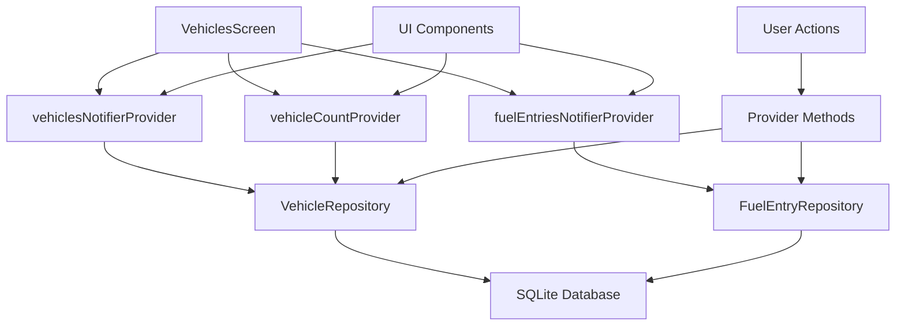

# Vehicle Management Implementation Guide

## Overview
This guide provides detailed technical information about the vehicle management system implementation in the Petrol Tracker application.

## Architecture Overview

### Component Hierarchy
```
VehiclesScreen
├── NavAppBar (title: "Vehicles")
├── _VehicleStats (statistics cards)
│   ├── _StatCard (Total Vehicles)
│   └── _StatCard (Total Entries)
├── _VehiclesList (main content)
│   ├── _EmptyVehiclesState (when no vehicles)
│   ├── _VehicleCard[] (vehicle items)
│   └── Error/Loading states
├── FloatingActionButton (add vehicle)
└── Dialogs
    ├── _AddVehicleDialog
    ├── _EditVehicleDialog
    └── Delete confirmation
```

### State Management Flow


## Implementation Details

### 1. Core Screen Implementation

#### VehiclesScreen Setup
```dart
class VehiclesScreen extends ConsumerStatefulWidget {
  const VehiclesScreen({super.key});

  @override
  ConsumerState<VehiclesScreen> createState() => _VehiclesScreenState();
}

class _VehiclesScreenState extends ConsumerState<VehiclesScreen> {
  @override
  Widget build(BuildContext context) {
    return Scaffold(
      appBar: NavAppBar(title: 'Vehicles', actions: [...]),
      body: Column(children: [
        const _VehicleStats(),
        Expanded(child: const _VehiclesList()),
      ]),
      floatingActionButton: FloatingActionButton(...),
    );
  }
}
```

#### Key Design Decisions
- **ConsumerStatefulWidget**: Enables Riverpod integration for reactive state management
- **Column layout**: Statistics at top, expandable list below
- **NavAppBar**: Consistent navigation experience across the app
- **FloatingActionButton**: Primary action for adding vehicles

### 2. Statistics Implementation

#### Real-time Data Display
```dart
class _VehicleStats extends ConsumerWidget {
  @override
  Widget build(BuildContext context, WidgetRef ref) {
    final vehicleCountAsync = ref.watch(vehicleCountProvider);
    final allFuelEntriesAsync = ref.watch(fuelEntriesNotifierProvider);

    return Container(
      padding: const EdgeInsets.all(16),
      child: Row(children: [
        _StatCard(
          title: 'Total Vehicles',
          value: vehicleCountAsync.when(
            data: (count) => count.toString(),
            loading: () => '...',
            error: (_, __) => '0',
          ),
        ),
        _StatCard(
          title: 'Total Entries',
          value: allFuelEntriesAsync.when(
            data: (entryState) => entryState.entries.length.toString(),
            loading: () => '...',
            error: (_, __) => '0',
          ),
        ),
      ]),
    );
  }
}
```

#### Statistics Features
- **Reactive updates**: Automatically refreshes when data changes
- **Loading states**: Shows placeholder during data fetch
- **Error handling**: Graceful degradation with fallback values
- **Consistent styling**: Material Design 3 card components

### 3. Vehicle List Implementation

#### Dynamic List Rendering
```dart
class _VehiclesList extends ConsumerWidget {
  @override
  Widget build(BuildContext context, WidgetRef ref) {
    final vehiclesAsync = ref.watch(vehiclesNotifierProvider);

    return vehiclesAsync.when(
      data: (vehicleState) {
        if (vehicleState.isLoading) return CircularProgressIndicator();
        if (vehicleState.error != null) return _ErrorState();
        if (vehicleState.vehicles.isEmpty) return _EmptyVehiclesState();
        
        return ListView.builder(
          itemCount: vehicleState.vehicles.length,
          itemBuilder: (context, index) => 
            _VehicleCard(vehicle: vehicleState.vehicles[index]),
        );
      },
      loading: () => CircularProgressIndicator(),
      error: (error, stack) => _ErrorState(),
    );
  }
}
```

#### List Features
- **Efficient rendering**: ListView.builder for performance
- **Multiple states**: Loading, error, empty, and populated states
- **Reactive updates**: Automatically updates when vehicles change
- **Scroll performance**: Optimized for large lists

### 4. Vehicle Card Implementation

#### Individual Vehicle Display
```dart
class _VehicleCard extends ConsumerWidget {
  final VehicleModel vehicle;

  @override
  Widget build(BuildContext context, WidgetRef ref) {
    final entriesAsync = ref.watch(fuelEntriesByVehicleProvider(vehicle.id!));

    return Card(
      child: ListTile(
        leading: CircleAvatar(child: Icon(Icons.directions_car)),
        title: Text(vehicle.name),
        subtitle: Column(children: [
          Text('Initial KM: ${vehicle.initialKm.toStringAsFixed(0)} km'),
          entriesAsync.when(
            data: (entries) => _buildEntryStats(entries),
            loading: () => Text('Loading entries...'),
            error: (_, __) => Text('Entries: 0'),
          ),
        ]),
        trailing: PopupMenuButton<String>(
          onSelected: (value) => _handleMenuSelection(context, ref, value),
          itemBuilder: (context) => [
            PopupMenuItem(value: 'entries', child: Text('View Entries')),
            PopupMenuItem(value: 'edit', child: Text('Edit')),
            PopupMenuItem(value: 'delete', child: Text('Delete')),
          ],
        ),
      ),
    );
  }
}
```

#### Card Features
- **Rich information**: Name, initial KM, entry statistics
- **Average consumption**: Calculated from fuel entries
- **Context actions**: Edit, delete, view entries
- **Navigation integration**: Routes to filtered entry views

### 5. Form Implementation

#### Add Vehicle Dialog
```dart
class _AddVehicleDialog extends StatefulWidget {
  final WidgetRef ref;

  @override
  State<_AddVehicleDialog> createState() => _AddVehicleDialogState();
}

class _AddVehicleDialogState extends State<_AddVehicleDialog> {
  final _formKey = GlobalKey<FormState>();
  final _nameController = TextEditingController();
  final _initialKmController = TextEditingController();

  Future<void> _saveVehicle() async {
    if (!_formKey.currentState!.validate()) return;

    final vehicle = VehicleModel.create(
      name: _nameController.text.trim(),
      initialKm: double.parse(_initialKmController.text),
    );

    // Validation
    final validationErrors = vehicle.validate();
    if (validationErrors.isNotEmpty) {
      throw Exception(validationErrors.first);
    }

    // Duplicate check
    final nameExists = await widget.ref.read(
      vehicleNameExistsProvider(_nameController.text.trim()).future,
    );
    if (nameExists) {
      throw Exception('A vehicle with this name already exists');
    }

    // Save vehicle
    await widget.ref.read(vehiclesNotifierProvider.notifier).addVehicle(vehicle);
  }
}
```

#### Form Features
- **Comprehensive validation**: Required fields, length limits, format checks
- **Async validation**: Duplicate name checking
- **Loading states**: Disabled form during submission
- **Error feedback**: Clear error messages and success notifications
- **Input formatting**: Numeric input restrictions for kilometers

### 6. Validation System

#### Vehicle Model Validation
```dart
// In VehicleModel
List<String> validate() {
  final errors = <String>[];

  // Name validation
  if (name.trim().isEmpty) {
    errors.add('Vehicle name is required');
  } else if (name.trim().length < 2) {
    errors.add('Vehicle name must be at least 2 characters long');
  } else if (name.trim().length > 100) {
    errors.add('Vehicle name must be less than 100 characters');
  }

  // Initial km validation
  if (initialKm < 0) {
    errors.add('Initial kilometers must be 0 or greater');
  }

  return errors;
}
```

#### Form Field Validation
```dart
TextFormField(
  controller: _nameController,
  validator: (value) {
    if (value == null || value.trim().isEmpty) {
      return 'Please enter a vehicle name';
    }
    if (value.trim().length < 2) {
      return 'Name must be at least 2 characters';
    }
    return null;
  },
)
```

## Provider Integration

### 1. Vehicle State Management

#### VehiclesNotifier Implementation
```dart
@riverpod
class VehiclesNotifier extends _$VehiclesNotifier {
  @override
  Future<VehicleState> build() async {
    return _loadVehicles();
  }

  Future<void> addVehicle(VehicleModel vehicle) async {
    state = AsyncValue.data(
      state.valueOrNull?.copyWith(isLoading: true) ?? 
      const VehicleState(isLoading: true)
    );

    try {
      final repository = ref.read(vehicleRepositoryProvider);
      final id = await repository.insertVehicle(vehicle);
      
      final newVehicle = vehicle.copyWith(id: id);
      final currentState = state.valueOrNull ?? const VehicleState();
      final updatedVehicles = [...currentState.vehicles, newVehicle];
      
      state = AsyncValue.data(
        currentState.copyWith(
          vehicles: updatedVehicles,
          isLoading: false,
          error: null,
        )
      );
    } catch (e) {
      // Error handling
    }
  }
}
```

### 2. Provider Usage Patterns

#### Watching for Changes
```dart
// Watch for vehicle list changes
final vehiclesAsync = ref.watch(vehiclesNotifierProvider);

// Watch for specific vehicle count
final countAsync = ref.watch(vehicleCountProvider);

// Watch vehicle-specific fuel entries
final entriesAsync = ref.watch(fuelEntriesByVehicleProvider(vehicleId));
```

#### Triggering Actions
```dart
// Add new vehicle
await ref.read(vehiclesNotifierProvider.notifier).addVehicle(vehicle);

// Update existing vehicle
await ref.read(vehiclesNotifierProvider.notifier).updateVehicle(vehicle);

// Delete vehicle
await ref.read(vehiclesNotifierProvider.notifier).deleteVehicle(vehicleId);

// Refresh data
await ref.refresh(vehiclesNotifierProvider);
```

## Error Handling

### 1. UI Error States

#### Error Display Component
```dart
Widget _buildErrorState(String error) {
  return Center(
    child: Column(
      mainAxisAlignment: MainAxisAlignment.center,
      children: [
        Icon(Icons.error_outline, size: 64, color: Colors.red),
        SizedBox(height: 16),
        Text('Error loading vehicles'),
        SizedBox(height: 8),
        Text(error),
        SizedBox(height: 16),
        ElevatedButton(
          onPressed: () => ref.refresh(vehiclesNotifierProvider),
          child: Text('Retry'),
        ),
      ],
    ),
  );
}
```

### 2. Form Error Handling

#### Validation Error Display
```dart
try {
  await _saveVehicle();
  if (mounted) {
    Navigator.of(context).pop();
    ScaffoldMessenger.of(context).showSnackBar(
      SnackBar(content: Text('Vehicle added successfully!')),
    );
  }
} catch (e) {
  if (mounted) {
    ScaffoldMessenger.of(context).showSnackBar(
      SnackBar(
        content: Text('Error adding vehicle: $e'),
        backgroundColor: Colors.red,
      ),
    );
  }
}
```

## Navigation Integration

### 1. Route Configuration

#### Vehicle-related Routes
```dart
// In app_router.dart
GoRoute(
  path: '/vehicles',
  name: 'vehicles',
  builder: (context, state) => const VehiclesScreen(),
),
GoRoute(
  path: '/entries',
  name: 'entries',
  builder: (context, state) => FuelEntriesScreen(
    vehicleFilter: state.extra?['vehicleId'],
  ),
),
```

### 2. Navigation Actions

#### Context-based Navigation
```dart
// Navigate to vehicle entries with filter
void _navigateToVehicleEntries(BuildContext context) {
  context.go('/entries', extra: {'vehicleId': vehicle.id});
}

// Return to vehicles from other screens
void _returnToVehicles(BuildContext context) {
  context.go('/vehicles');
}
```

## Performance Optimization

### 1. Efficient Rendering

#### Widget Optimization Techniques
- **ConsumerWidget**: Only rebuilds when watched providers change
- **ListView.builder**: Lazy loading for large lists
- **const constructors**: Reduces widget rebuilds
- **Provider scoping**: Minimizes unnecessary provider watches

### 2. Memory Management

#### Resource Cleanup
```dart
@override
void dispose() {
  _nameController.dispose();
  _initialKmController.dispose();
  super.dispose();
}
```

### 3. Database Optimization

#### Efficient Queries
- Repository pattern for centralized data access
- Proper indexing on frequently queried fields
- Batch operations for multiple updates
- Connection pooling and reuse

## Testing Strategy

### 1. Widget Testing

#### Basic Screen Testing
```dart
testWidgets('Should build VehiclesScreen without errors', (tester) async {
  await tester.pumpWidget(
    ProviderScope(
      child: MaterialApp(home: VehiclesScreen()),
    ),
  );

  expect(find.byType(VehiclesScreen), findsOneWidget);
  expect(find.text('Vehicles'), findsOneWidget);
});
```

### 2. Provider Testing

#### State Management Testing
```dart
test('Should add vehicle successfully', () async {
  final container = ProviderContainer();
  final notifier = container.read(vehiclesNotifierProvider.notifier);
  
  await notifier.addVehicle(testVehicle);
  
  final state = container.read(vehiclesNotifierProvider);
  expect(state.vehicles.length, equals(1));
  expect(state.vehicles.first.name, equals(testVehicle.name));
});
```

## Security Considerations

### 1. Input Validation
- Server-side validation for all inputs
- SQL injection prevention through parameterized queries
- XSS prevention through proper input sanitization
- File upload restrictions and validation

### 2. Data Protection
- Sensitive data encryption at rest
- Secure data transmission (HTTPS)
- Proper authentication and authorization
- Regular security audits and updates

## Future Enhancements

### 1. Planned Features
- Vehicle photo upload and management
- Advanced filtering and sorting options
- Bulk operations (multi-select)
- Vehicle sharing and collaboration
- Import/export functionality

### 2. Performance Improvements
- Implement pagination for large vehicle lists
- Add caching layer for frequently accessed data
- Optimize database queries with proper indexing
- Implement offline support with sync capabilities

### 3. UX Enhancements
- Add drag-and-drop reordering
- Implement advanced search functionality
- Add vehicle templates and presets
- Enhance accessibility features

## Troubleshooting

### Common Issues

#### Provider Not Updating
```dart
// Ensure proper provider watching
final vehiclesAsync = ref.watch(vehiclesNotifierProvider); // ✅ Correct
final vehicles = ref.read(vehiclesNotifierProvider); // ❌ Won't update UI
```

#### Form Validation Not Working
```dart
// Ensure form key is used correctly
final _formKey = GlobalKey<FormState>();

// In build method
Form(key: _formKey, child: ...)

// In submit method
if (!_formKey.currentState!.validate()) return;
```

#### Memory Leaks
```dart
// Always dispose controllers
@override
void dispose() {
  _nameController.dispose();
  _initialKmController.dispose();
  super.dispose();
}
```

This implementation guide provides comprehensive coverage of the vehicle management system, serving as both documentation and reference for future development and maintenance.